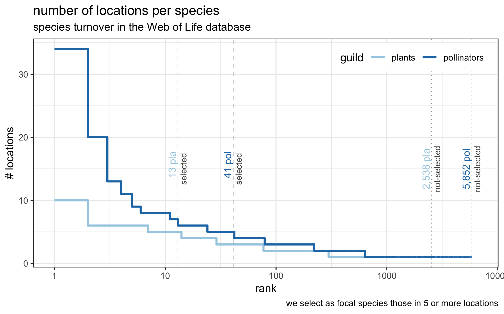
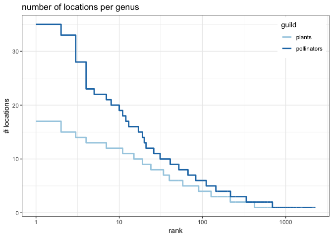
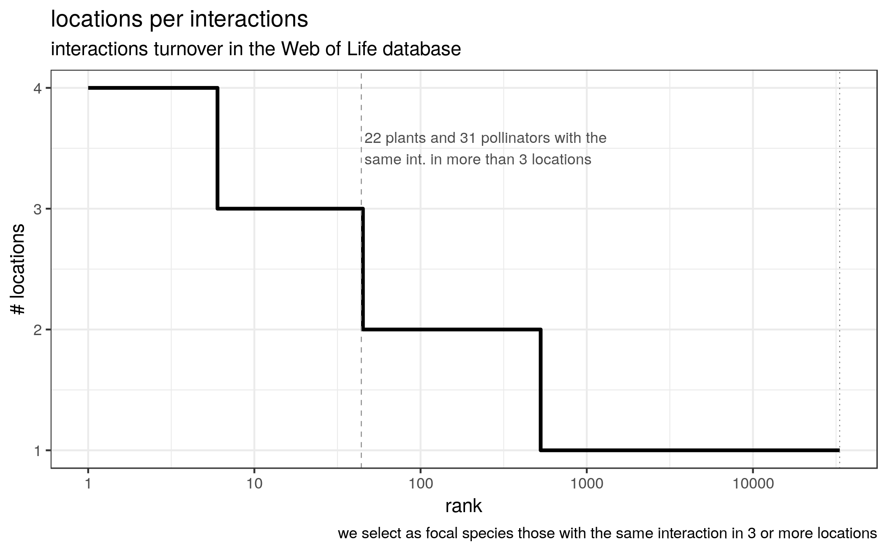
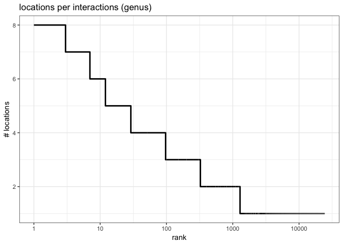

The research question is to investigate whether species interact differently in the core of their range versus at the fringes of their distribution, where one would expect it to be harder.

The aim of this document is to explore whetherthe interaction data available in the Bascompte's Web of Life is adequate to answer this question or not.

We start by checking wether species (and interactions) are reflected in enough localities to be able to detect a signal of change across the habitat.

Species turnover
================

Interactions turnover
=====================
