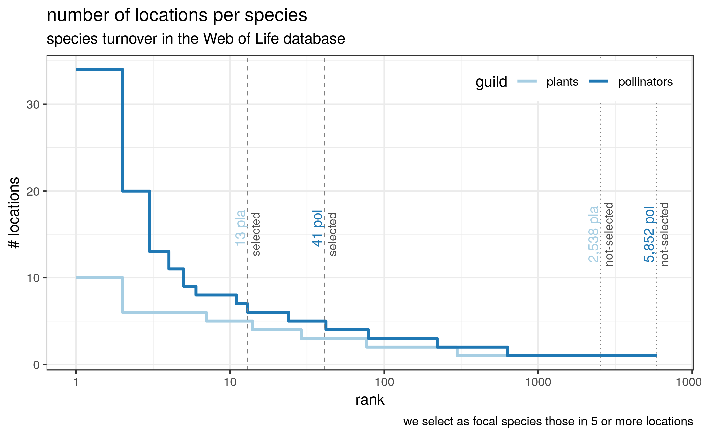

Interactions at the fringes, data exploration
=============================================

We want to investigate whether species interact differently at the core of their range compared to the fringes of their distribution. One could expect species to diversify their interactions as interaction parters become less common/available. Alternatively, one could expect species to interact with only a subset of the interaction partners, as they cannot develop new interactions when environemntal conditions are close to the limits of where possitive groth rates occur.

The aim of this document is to explore whether the interaction data available in the Bascompte's Web of Life could be adequate to answer this question or not.

Species & interaction turnover
------------------------------

We start by checking wether species and interactions occur in enough localities. Unknown and unindentified species are excluded from the final numbers.

If species turnover is too high the data might not be adequate to answer the research question. At first we set an arbitrary, but reasonable threshold of **five** locations. We need species to be present in at least this number of locations to have a relatively OK coverage across their range.

With this threshold of five we have 13 plants and 41 pollination species that could be candidates to be focal species.

We then check the turnover of the interactions. We expect a large degree of turnover here, but if we are to compare interactions at the fringes of a species distributions with those at the core, we need at some of the interactions to be sampled at several locations. These would compose the "core" of the species interactions. At first we set an arbitrary, but reasonable threshold of **three** locations.

With this threshold we have 44 interactions that repeat over at least three locations or more. Specifically 22 plants and 31 pollinators are involved in these interactions.

### Degree vs. widespread

